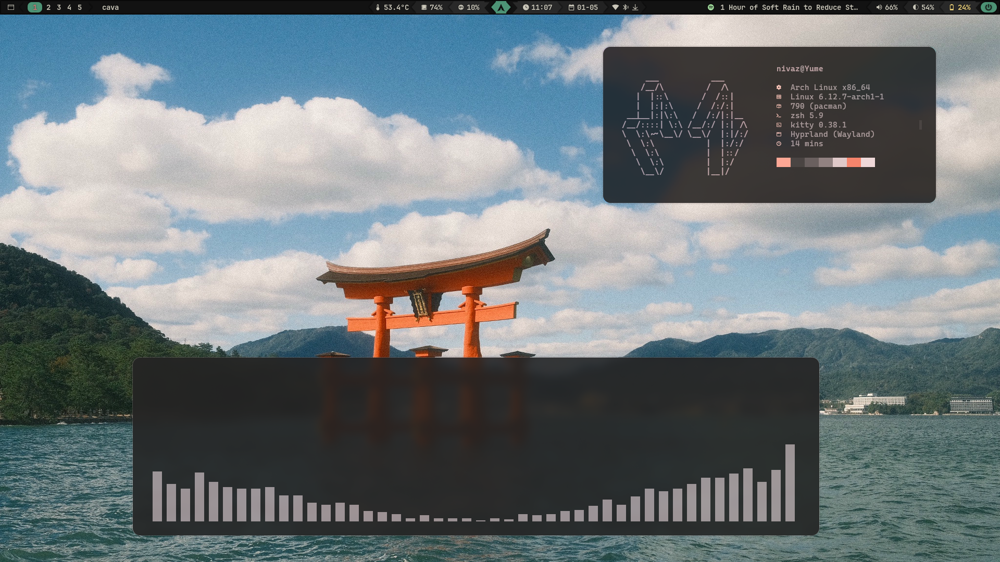
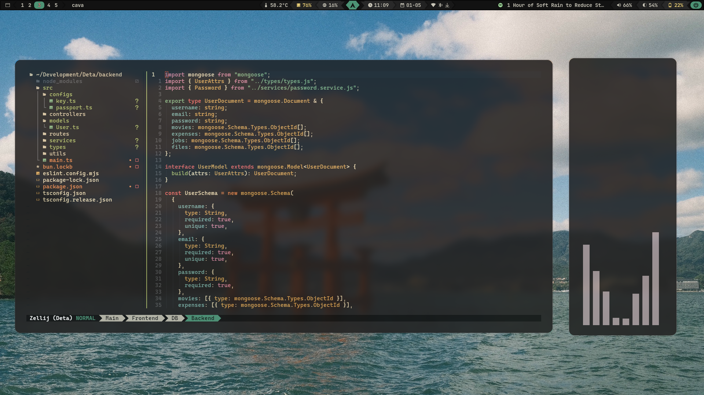

# Nivaz dotfiles

This repository contains my ever-evolving dotfiles. check them out! If you find something useful, feel free to add it to yur own dotfiles.

 
 

## Description

> Note: The GTK theme will added soon..

This repository contains personal configuration files for Linux-based systems, specifically tailored for Arch Linux. This is where I do my rices =D

## Installation

> An observation: There's probably a better and easier way to do this installation, so if you know a better way, please let me know, I'm not an expert in Managing dotfiles and Arch linux..

> TODO:

- [x] GTK theme
- [ ] Installation Setup
- [ ] Credits
